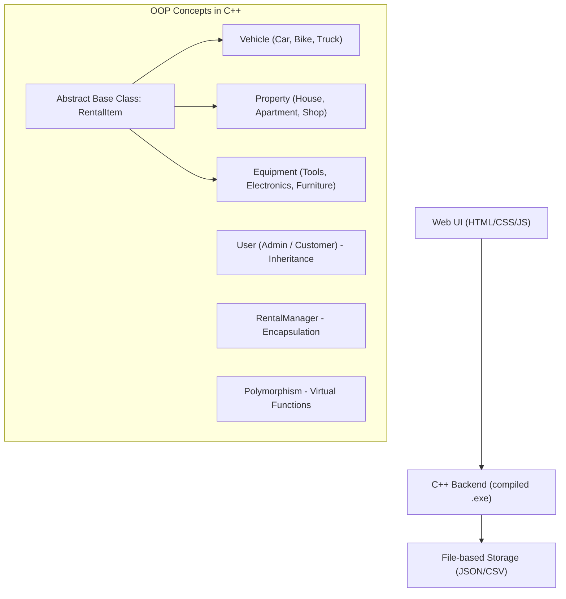
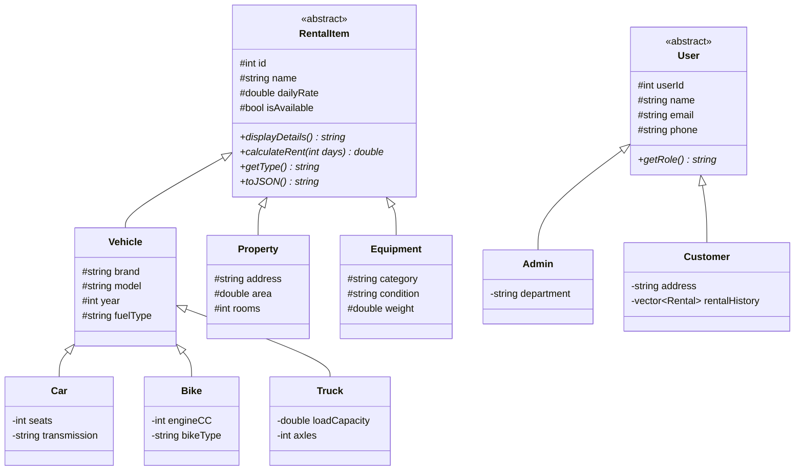

# Rental Management System — OOP Project

A comprehensive Rental Management System built to demonstrate **all core OOP concepts** (Encapsulation, Inheritance, Polymorphism, Abstraction) for an OOP subject. The system manages **Vehicle**, **Property**, and **Equipment** rentals with a stunning web-based UI and C++ backend logic.

---

## Architecture Overview

## OOP Concepts Demonstrated

| OOP Concept | Where It's Used |
|---|---|
| **Encapsulation** | Private data members with public getters/setters in all classes. `RentalManager` class hides file I/O complexity. |
| **Inheritance** | `Vehicle`, `Property`, `Equipment` inherit from abstract `RentalItem`. `Admin` and `Customer` inherit from `User`. |
| **Polymorphism** | Virtual functions `displayDetails()`, `calculateRent()`, `getType()` behave differently for each rental type. Operator overloading for comparisons. |
| **Abstraction** | Abstract base class `RentalItem` with pure virtual functions. `User` abstract class. |
| **Composition** | `RentalManager` contains collections of `RentalItem` objects. `Rental` class composes `User` and `RentalItem`. |
| **Operator Overloading** | `<<` operator for display, `==` for comparison, `<` for sorting |
| **Friend Functions** | Friend function for formatted output |
| **Templates** | Template-based search utility |
| **File Handling** | Persistent data storage using file I/O |

## Proposed Changes

### C++ Backend (Core OOP Logic)

#### [NEW] [RentalItem.h](file:///c:/Users/adity/OneDrive/Desktop/rental%20managment%20system/RentalItem.h)
- Abstract base class with pure virtual functions
- Demonstrates **Abstraction** and **Polymorphism**
- Pure virtual: `displayDetails()`, `calculateRent()`, `getType()`, `toJSON()`

#### [NEW] [Vehicle.h](file:///c:/Users/adity/OneDrive/Desktop/rental%20managment%20system/Vehicle.h)
- Inherits from `RentalItem` — demonstrates **Inheritance**
- Subclasses: `Car`, `Bike`, `Truck` — demonstrates **Multi-level Inheritance**
- Overrides virtual functions — demonstrates **Polymorphism**

#### [NEW] [Property.h](file:///c:/Users/adity/OneDrive/Desktop/rental%20managment%20system/Property.h)
- Inherits from `RentalItem`
- Subclasses: `House`, `Apartment`, `Shop`

#### [NEW] [Equipment.h](file:///c:/Users/adity/OneDrive/Desktop/rental%20managment%20system/Equipment.h)
- Inherits from `RentalItem`
- Subclasses: `Tool`, `Electronic`, `Furniture`

#### [NEW] [User.h](file:///c:/Users/adity/OneDrive/Desktop/rental%20managment%20system/User.h)
- Abstract `User` base class with `Admin` and `Customer` derived classes
- Demonstrates **Inheritance** and **Encapsulation**

#### [NEW] [Rental.h](file:///c:/Users/adity/OneDrive/Desktop/rental%20managment%20system/Rental.h)
- **Composition** — contains `User` and `RentalItem` references
- Tracks rental dates, status, total cost

#### [NEW] [RentalManager.h](file:///c:/Users/adity/OneDrive/Desktop/rental%20managment%20system/RentalManager.h)
- **Encapsulation** — manages all business logic
- CRUD operations, search, filter, sort
- **Templates** for generic search

#### [NEW] [main.cpp](file:///c:/Users/adity/OneDrive/Desktop/rental%20managment%20system/main.cpp)
- Console-based menu system that works as the C++ backend
- Demonstrates all OOP concepts in action
- File I/O for data persistence

---

### Web-based UI (Beautiful Frontend)

#### [NEW] [index.html](file:///c:/Users/adity/OneDrive/Desktop/rental%20managment%20system/web/index.html)
- Main dashboard with navigation
- Sections: Dashboard, Vehicles, Properties, Equipment, Rentals, Users

#### [NEW] [style.css](file:///c:/Users/adity/OneDrive/Desktop/rental%20managment%20system/web/style.css)
- Premium dark-mode glassmorphism design
- Smooth animations and micro-interactions
- Gradient accents, modern typography (Inter font)
- Fully responsive layout

#### [NEW] [app.js](file:///c:/Users/adity/OneDrive/Desktop/rental%20managment%20system/web/app.js)
- **OOP in JavaScript too** — mirrors the C++ class hierarchy
- Full CRUD operations with localStorage persistence
- Interactive charts and dashboard analytics
- Modal dialogs, search, filter, sort functionality

---

## Class Hierarchy Diagram

## Verification Plan

### Manual Verification
- Compile and run the C++ code with `g++ main.cpp -o rental_system`
- Open the web UI in browser and test all CRUD operations
- Verify all OOP concepts are properly demonstrated
- Test data persistence (localStorage for web, file I/O for C++)
